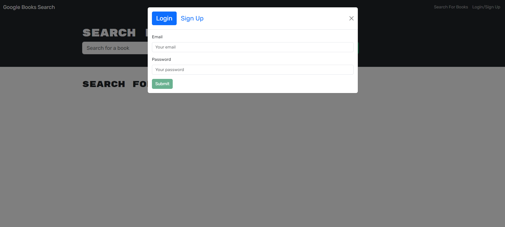
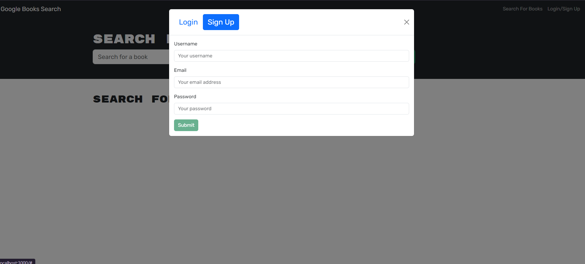
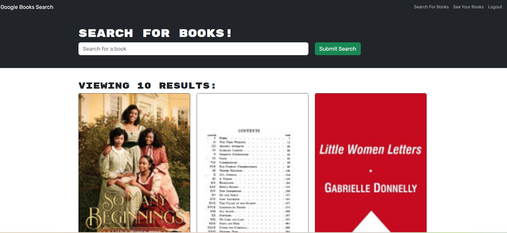
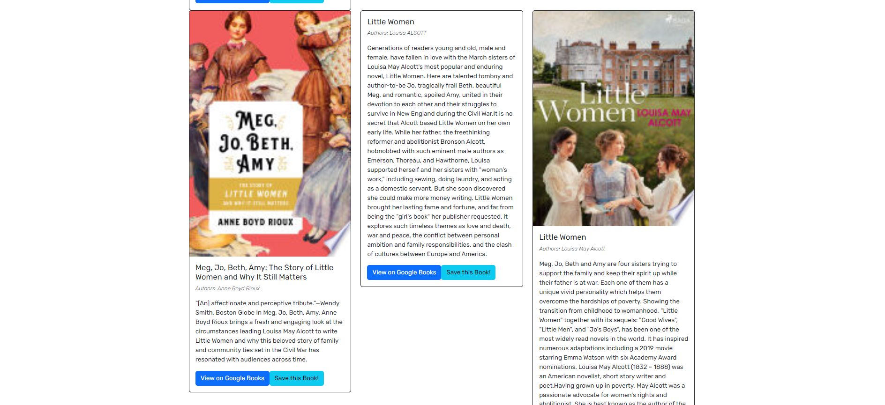
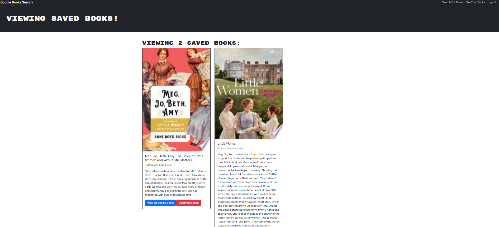

# MERN: Book Search Engine <!-- omit in toc -->


## Description <!-- omit in toc -->

In response to the growing demand for efficient and personalized data handling in web applications, as well as the need for users to search for new books and manage their book lists, this week’s challenge from the UT Austin Coding Boot Camp involves refactoring an existing Google Books API search engine from a RESTful API to a GraphQL API. By implementing a GraphQL API with Apollo Server, the MERN Book Search Engine enables more efficient, on-demand data retrieval and management.

The MERN Book Search Engine allows users to effortlessly search for books using the Google Books API and save their favorite titles for future reference. It also supports secure login, sign-up, and access to saved books. Built with the MERN stack (MongoDB, Express.js, React, Node.js), this application leverages GraphQL to enhance data retrieval and management, boosting performance and flexibility while delivering a modern, responsive user experience. Deployed on Render with MongoDB Atlas for database management, it provides a streamlined and efficient book browsing experience for avid readers.

By addressing the need for efficient book discovery and management, the MERN Book Search Engine significantly enhances user satisfaction. It demonstrates the advantages of modern web technologies in transforming user experiences through precise data management, secure JWT-based authentication, and a responsive design.

## Table of Contents <!-- omit in toc -->

- [User Story](#user-story)
- [Acceptance Criteria](#acceptance-criteria)
- [Technologies Used](#technologies-used)
- [Features](#features)
- [Installation](#installation)
- [Usage](#usage)
  - [Screenshots](#screenshots)
- [Tests](#tests)
- [Links](#links)
- [Credits](#credits)
- [License](#license)
- [Questions](#questions)

## User Story

```md
AS AN avid reader
I WANT to search for new books to read
SO THAT I can keep a list of books to purchase
```

## Acceptance Criteria

```md
GIVEN a book search engine
WHEN I load the search engine
THEN I am presented with a menu with the options Search for Books and Login/Signup and an input field to search for books and a submit button
WHEN I click on the Search for Books menu option
THEN I am presented with an input field to search for books and a submit button
WHEN I am not logged in and enter a search term in the input field and click the submit button
THEN I am presented with several search results, each featuring a book’s title, author, description, image, and a link to that book on the Google Books site
WHEN I click on the Login/Signup menu option
THEN a modal appears on the screen with a toggle between the option to log in or sign up
WHEN the toggle is set to Signup
THEN I am presented with three inputs for a username, an email address, and a password, and a signup button
WHEN the toggle is set to Login
THEN I am presented with two inputs for an email address and a password and login button
WHEN I enter a valid email address and create a password and click on the signup button
THEN my user account is created and I am logged in to the site
WHEN I enter my account’s email address and password and click on the login button
THEN I the modal closes and I am logged in to the site
WHEN I am logged in to the site
THEN the menu options change to Search for Books, an option to see my saved books, and Logout
WHEN I am logged in and enter a search term in the input field and click the submit button
THEN I am presented with several search results, each featuring a book’s title, author, description, image, and a link to that book on the Google Books site and a button to save a book to my account
WHEN I click on the Save button on a book
THEN that book’s information is saved to my account
WHEN I click on the option to see my saved books
THEN I am presented with all of the books I have saved to my account, each featuring the book’s title, author, description, image, and a link to that book on the Google Books site and a button to remove a book from my account
WHEN I click on the Remove button on a book
THEN that book is deleted from my saved books list
WHEN I click on the Logout button
THEN I am logged out of the site and presented with a menu with the options Search for Books and Login/Signup and an input field to search for books and a submit button
```

## Technologies Used

- **MongoDB:** NoSQL database for storing user data and saved books.
- **MongoDB Atlas:** Cloud-based storage for the MongoDB database.
- **Mongoose:** ODM (Object Data Modeling) library for managing MongoDB data in Node.js.
- **Express.js:** Web framework for building the server and handling API requests.
- **Node.js:** JavaScript runtime for building a scalable, efficient server-side application.
- **React.js:** Front-end library for building the user interface.
- **GraphQL:** Query language for APIs, used to fetch and modify data.
- **Apollo Server:** Handles GraphQL requests on the server.
- **Apollo Client:** Connects the front-end React application to the Apollo Server.
- **JWT (JSON Web Tokens):** Manages user authentication and authorization securely.
- **Bcrypt:** Library for hashing passwords and enhancing security.
- **Nodemon:** Utility that monitors changes in application source code and automatically restarts the server.
- **Bootstrap** CSS framework for building responsive, mobile-first designs.
- **react-router-dom:** Library for routing and navigation in React applications.
- **Vite:** Build tool that provides a faster development experience for React applications.
- **concurrently:** Used for running the server and front-end applications simultaneously during development.
- **Google Books API:** Provides book search functionality for the application.
- **Render:** Deployment platform used for hosting the application.

## Features

- **Book Search:** Effortlessly search for books by title using the Google Books API.
- **User Authentication:** Securely sign up or log in to access personalized features, including saving your favorite book and/or managing your saved list.
- **Save Books:** Save searched books to your personal saved list for future reference and easy access with a single click.
- **View Saved Books:** View an organized list of your saved books on a single page as well as their details.
- **Remove Saved Books:** Easily remove books from your saved list with a single click if you no longer wish to keep a book in your collection.
- **Book Details:** Access detailed information about each searched book, including title, author, description, image, and a link that directs you to the Google Books site.
- **GraphQL API Integration:** Utilize GraphQL API for efficient querying and mutation of data, allowing for seamless interaction with user and book data, enhancing performance and flexibility.
- **Optimized Data Fetching:** GraphQL ensures that only the necessary data is fetched for each request, improving performance and user experience.
- **Google Books API Integration:** Provides users with an up-to-date and comprehensive database of books to search through in real-time.
- **Responsive Design:** Enjoy a consistent and user-friendly experience across all devices, including desktop and mobile platforms, ensuring functionality and readability on any screen size.
- **Interactive UI:** Experience an intuitive and engaging user interface for managing your saved books that is designed to be interactive, making it easy to navigate, search, and organize your book collection.

## Installation

1. **Clone the Repository**:

   ```bash
   git clone https://github.com/vaughanknouse/MERN-Book-Search-Engine.git
   ```

2. **Install Node.js, npm, and MongoDB**: Ensure that the current versions of Node.js, npm, and MongoDB are installed on your machine.

3. **Navigate to the Project Directory**:

   ```bash
    cd MERN-Book-Search-Portfolio
   ```

4. **Install Dependencies**:

   ```bash
   npm install
   ```

## Usage

To use the MERN Book Search Engine, you can either access the deployed version on Render or host the application locally.

**Option 1: Deployed Version:** Visit the following link to use the app online: <https://mern-book-search-engine-2zkt.onrender.com>

**Option 2: Hosting Locally:**
If you prefer to host the application locally, follow these steps:

1. **Start the server**: After completing the installation steps (see Installation), invoke the application by running:

   ```bash
    npm run develop
   ```

2. **Access the Application:** Open a browser and navigate to <http://localhost:3000>.
3. **Book Search Interface:** Upon loading the application, you'll see the Book Search Engine interface with options to "Search for Books," "Login/Signup," and a search bar to search for a book.
4. **User Account Access:** When you click "Login/Signup," a modal will prompt you to log in or sign up, allowing you to create a new account or log in to an existing one.
5. **Search and Save Books:** After logging in, you can search for a book by entering its name in the search bar. The results will display relevant books, and you can save any book to your saved list by clicking "Save This Book!".
6. **View, Manage, and Delete Saved Books:** By navigating to "My Saved Books", you can view your list of saved books. If desired, you can remove any saved book by clicking "Delete this Book".

### Screenshots

The following screenshots demonstrate the application's functionality and appearance:

**Homepage:**


**Login/Sign Up:**




**Homepage while Logged In:**



**Book Search Results while Logged in:**



**Saved Books Page:**



## Tests

There is no testing involved for this application.

## Links

GitHub Repository: <https://github.com/vaughanknouse/MERN-Book-Search-Engine>

Render Deployed Application Link: <https://mern-book-search-engine-2zkt.onrender.com>

## Credits

Used the following starter code and sources as tutorials and guidelines:

[Starter code repository provided by UT Austin Coding Boot Camp](https://github.com/coding-boot-camp/solid-broccoli)

[GraphQL Query](https://graphql.org/learn/queries/)

[Resolvers](https://www.apollographql.com/docs/apollo-server/data/resolvers/)

[Mutations](https://www.apollographql.com/docs/react/data/mutations/)

[Authentication in GraphQL API](https://www.apollographql.com/docs/react/networking/authentication/)

[ChatGPT](https://chatgpt.com/?oai-dm=1)

[Xpert Learning Assistant](https://bootcampspot.instructure.com/courses/5293/external_tools/313)

## License

This project is licensed under the MIT license. For more information, please visit [this link](https://opensource.org/licenses/MIT).

## Questions

For any questions or feedback, please contact me via email at <vaughanknouse@gmail.com>.

Additionally, you can find me on GitHub at [vaughanknouse](https://github.com/vaughanknouse).
