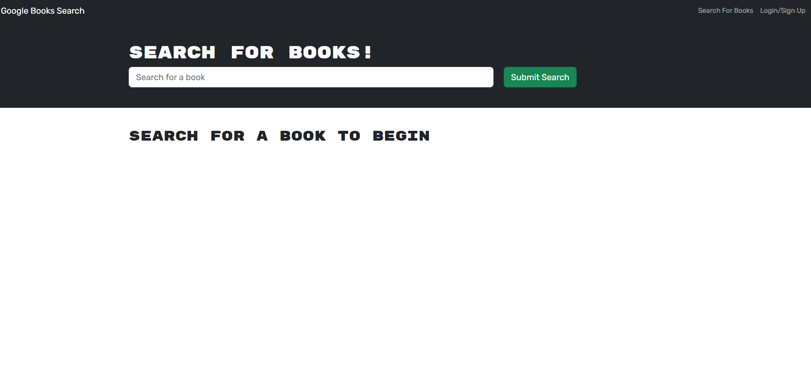

# MERN: Book Search Engine <!-- omit in toc -->


## Description \*\*\* <!-- omit in toc -->

## Table of Contents <!-- omit in toc -->

- [User Story](#user-story)
- [Acceptance Criteria](#acceptance-criteria)
- [Technologies Used \*\*\*](#technologies-used-)
- [Features \*\*\*](#features-)
- [Installation](#installation)
- [Usage](#usage)
  - [Screenshots](#screenshots)
- [Tests](#tests)
- [Links](#links)
- [Credits](#credits)
- [License](#license)
- [Questions](#questions)

## User Story

```md
AS AN avid reader
I WANT to search for new books to read
SO THAT I can keep a list of books to purchase
```

## Acceptance Criteria

```md
GIVEN a book search engine
WHEN I load the search engine
THEN I am presented with a menu with the options Search for Books and Login/Signup and an input field to search for books and a submit button
WHEN I click on the Search for Books menu option
THEN I am presented with an input field to search for books and a submit button
WHEN I am not logged in and enter a search term in the input field and click the submit button
THEN I am presented with several search results, each featuring a book’s title, author, description, image, and a link to that book on the Google Books site
WHEN I click on the Login/Signup menu option
THEN a modal appears on the screen with a toggle between the option to log in or sign up
WHEN the toggle is set to Signup
THEN I am presented with three inputs for a username, an email address, and a password, and a signup button
WHEN the toggle is set to Login
THEN I am presented with two inputs for an email address and a password and login button
WHEN I enter a valid email address and create a password and click on the signup button
THEN my user account is created and I am logged in to the site
WHEN I enter my account’s email address and password and click on the login button
THEN I the modal closes and I am logged in to the site
WHEN I am logged in to the site
THEN the menu options change to Search for Books, an option to see my saved books, and Logout
WHEN I am logged in and enter a search term in the input field and click the submit button
THEN I am presented with several search results, each featuring a book’s title, author, description, image, and a link to that book on the Google Books site and a button to save a book to my account
WHEN I click on the Save button on a book
THEN that book’s information is saved to my account
WHEN I click on the option to see my saved books
THEN I am presented with all of the books I have saved to my account, each featuring the book’s title, author, description, image, and a link to that book on the Google Books site and a button to remove a book from my account
WHEN I click on the Remove button on a book
THEN that book is deleted from my saved books list
WHEN I click on the Logout button
THEN I am logged out of the site and presented with a menu with the options Search for Books and Login/Signup and an input field to search for books and a submit button
```

## Technologies Used \*\*\*

## Features \*\*\*

## Installation

1. **Clone the Repository**:

   ```bash
   git clone https://github.com/vaughanknouse/MERN-Book-Search-Engine.git
   ```

2. **Install Node.js, npm, and MongoDB**: Ensure that the current versions of Node.js, npm, and MongoDB are installed on your machine.

3. **Navigate to the Project Directory**:

   ```bash
    cd MERN-Book-Search-Portfolio
   ```

4. **Install Dependencies**:

   ```bash
   npm install
   ```

## Usage

To use the MERN Book Search Engine, you can either access the deployed version on Render or host the application locally.

**Option 1: Deployed Version:** Visit the following link to use the app online: <https://mern-book-search-engine-2zkt.onrender.com>

**Option 2: Hosting Locally:**
If you prefer to host the application locally, follow these steps:

1. **Start the server**: After completing the installation steps (see Installation), invoke the application by running:

   ```bash
    npm run develop
   ```

2. **Access the Application:** Open a browser and navigate to <http://localhost:3000>.
3. **Book Search Interface:** Upon loading the application, you'll see the Book Search Engine interface with options to "Search for Books," "Login/Signup," and a search bar to search for a book.
4. **User Account Access:** When you click "Login/Signup," a modal will prompt you to log in or sign up, allowing you to create a new account or log in to an existing one.
5. **Search and Save Books:** After logging in, you can search for a book by entering its name in the search bar. The results will display relevant books, and you can save any book to your saved list by clicking "Save This Book!".
6. **View, Manage, and Delete Saved Books:** By navigating to "My Saved Books", you can view your list of saved books. If desired, you can remove any saved book by clicking "Delete this Book".

### Screenshots

The following screenshots demonstrate the application's functionality and appearance:

**Homepage:**



**Login/Sign Up:**


**Homepage while Logged In:**


**Book Search Results while Logged in:**


**Saved Books Page:**


## Tests

There is no testing involved for this application.

## Links

GitHub Repository: <https://github.com/vaughanknouse/MERN-Book-Search-Engine>

Render Deployed Application Link: <https://mern-book-search-engine-2zkt.onrender.com>

## Credits

Used the following starter code and sources as tutorials and guidelines:

[Starter code repository provided by UT Austin Coding Boot Camp](https://github.com/coding-boot-camp/solid-broccoli)

[GraphQL Query](https://graphql.org/learn/queries/)

[Resolvers](https://www.apollographql.com/docs/apollo-server/data/resolvers/)

[Mutations](https://www.apollographql.com/docs/react/data/mutations/)

[Authentication in GraphQL API](https://www.apollographql.com/docs/react/networking/authentication/)

[ChatGPT](https://chatgpt.com/?oai-dm=1)

[Xpert Learning Assistant](https://bootcampspot.instructure.com/courses/5293/external_tools/313)

## License

This project is licensed under the MIT license. For more information, please visit [this link](https://opensource.org/licenses/MIT).

## Questions

For any questions or feedback, please contact me via email at <vaughanknouse@gmail.com>.

Additionally, you can find me on GitHub at [vaughanknouse](https://github.com/vaughanknouse).
